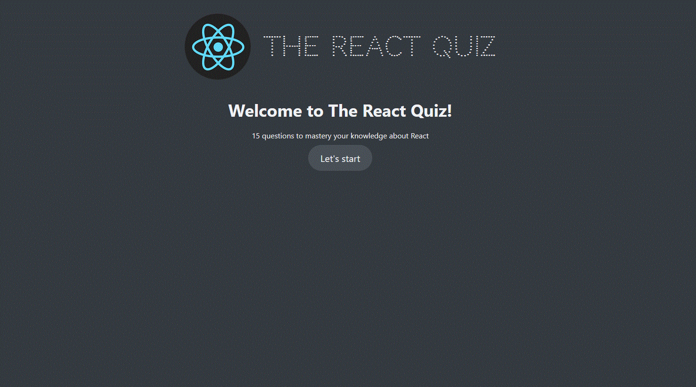

# ReactQuiz

Quiz with questions about React

## ℹ️ Basic concept

The basic assumption when creating React Quiz App was to learn how useReducer works and implement it using TypeScript. Additionally, simulate the REST API using a local server using JSONServer.

## ❓ How it works

User answers questions about React. He has a limited time for this and a certain number of points to earn. Each question has a different point value. At the end of the quiz, the user receives a summary with his result.




## Run Locally

Make sure you have Node and npm installed (https://nodejs.org/en)

Clone the project

```bash
  git clone https://github.com/dosmiko7/React-Quiz
```

Go to the project directory

```bash
  cd React-Quiz
```

Install dependencies

```bash
  npm install
```

Start the JSONserver

```bash
  npm run server
```

Start the site

```bash
  npm run start
```

## Tech Stack

- Vite
- Node v18.14.2
- npm v9.5.0
- React,
- TypeScript,
- CSS,
- JSONServer

## Author

Mikołaj Oberda
[@dosmiko7](https://www.github.com/dosmiko7)
